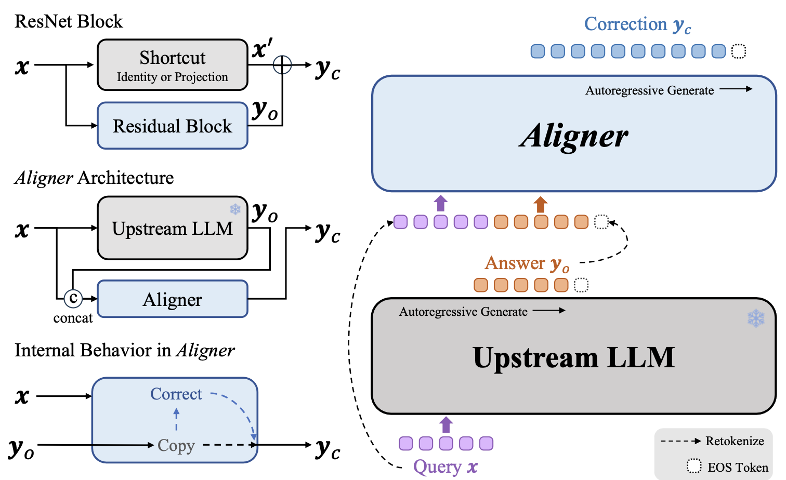
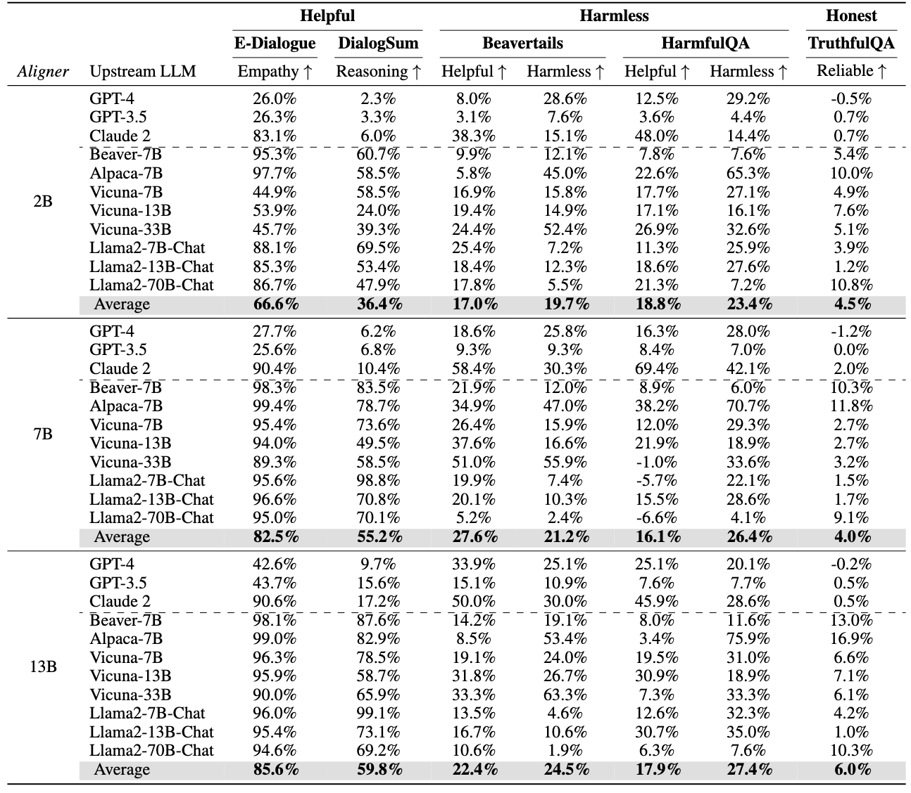

<h1 align="center">(NeurIPS 2024 Oral) Aligner: Efficient Alignment by <br> Learning to Correct   </h1>

This repository contains the source code for our NeurIPS 2024 paper [Aligner: Efficient Alignment by Learning to Correct](https://arxiv.org/abs/2402.02416).


[Jiaming Ji*](https://jijiaming.com/), [Boyuan Chen*](https://cby-pku.github.io/), [Hantao Lou](https://htlou.github.io/), [Donghai Hong](https://scholar.google.com/citations?user=JQx-_5gAAAAJ), [Borong Zhang](https://github.com/muchvo), [Xuehai Pan](https://github.com/XuehaiPan), [Juntao Dai](https://scholar.google.com/citations?user=eRmX5AsAAAAJ&hl=zh-CN), [Tianyi Qiu](https://tianyiqiu.net/) and [Yaodong Yang](https://www.yangyaodong.com/)

Work done by [PKU-Alignment Team](https://github.com/PKU-Alignment)

## Abstract
With the rapid development of large language models (LLMs) and ever-evolving practical requirements, finding an efficient and effective alignment method has never been more critical. However, the tension between the complexity of current alignment methods and the need for rapid iteration in deployment scenarios necessitates the development of a model-agnostic alignment approach that can operate under these constraints. In this paper, we introduce *Aligner*, a novel and simple alignment paradigm that learns the correctional residuals between preferred and dispreferred answers using a small model.
Designed as a model-agnostic, plug-and-play module, *Aligner* can be directly applied to various open-source and API-based models with only one-off training, making it suitable for rapid iteration.
Notably, *Aligner* can be applied to any powerful, large-scale upstream models. 
Moreover, it can even iteratively bootstrap the upstream models using corrected responses as synthetic human preference data, breaking through the model's performance ceiling.
Our experiments demonstrate performance improvements by deploying the same *Aligner* model across 11 different LLMs, evaluated on the 3H dimensions (helpfulness, harmlessness, and honesty).
Specifically, *Aligner*-7B has achieved an average improvement of 68.9\% in helpfulness and 22.8\% in harmlessness across the tested LLMs while also effectively reducing hallucination.
In the Alpaca-Eval leaderboard, stacking *Aligner*-2B on GPT-4 Turbo improved its LC Win Rate from 55.0\% to 58.3\%, surpassing GPT-4 Omni's 57.5\% Win Rate (community report).

See our website for more details : https://pku-aligner.github.io/

## Citation

Please cite our work if you find it useful and meaningful.

```bibtex
@inproceedings{ji2024aligner,
  title={Aligner: Efficient Alignment by Learning to Correct},
  author={Jiaming Ji and Boyuan Chen and Hantao Lou and Donghai Hong and Borong Zhang and Xuehai Pan and Tianyi Qiu and Juntao Dai and Yaodong Yang},
  booktitle={The Thirty-eighth Annual Conference on Neural Information Processing Systems},
  year={2024},
  url={https://openreview.net/forum?id=kq166jACVP}
}
```

### Table of Contents  <!-- omit in toc -->

- [<em>Aligner</em>: Efficient Alignment by Learning to Correct](#Aligner)
- [Installation](#installation)
- [Training](#training)
- [Dataset & Models](#dataset-models)
- [Acknowledgment](#acknowledgment)


## <em>Aligner</em>: Efficient Alignment by Learning to Correct 

### Architecture of the *Aligner* module.
As a plug-and-play module *Aligner* stack upon an upstream LLM. The *Aligner* redistributes initial answers from the upstream model into more helpful and harmless answers, thus aligning the composed LLM responses with human intentions.

<div align="center">
  
</div>

### Illustration of its behavior in architecture and semantic space.
Like a residual block that adds modifications via a shortcut without altering the base structure, the *Aligner* employs a *copy and correct* method to improve the original answer. 
This analogy highlights the *Aligner*'s dual role in preserving the parameter of the upstream model while enhancing it to align with desired outcomes.

<div align="center">
  
</div>

### Performance of *Aligner* Models
It is shown that *Aligner* achieves significant performances in all the settings. All assessments in this table were conducted based on integrating various models with *Aligner*s to compare with the original models to quantify the percentage increase in the *3H* standard.
When integrated and assessed in conjunction with various upstream models, the *Aligner* requires only a single training session (*i.e.*, the *Aligner* can operate in a zero-shot manner and enhance the performance of all upstream models.)
<div align="center">
  
</div>

### More Details
For more details, please refer to our [website]( https://pku-aligner.github.io/) 

## Installation
Clone the source code from GitHub:

```bash
git clone https://github.com/cby-pku/aligner.git
cd aligner
```

**Native Runner:** Setup a conda environment using [`conda`](https://github.com/conda/conda) / [`mamba`](https://github.com/mamba-org/mamba):

```bash
conda env create --file conda-recipe.yaml  # or `mamba env create --file conda-recipe.yaml`
```

## Training

`aligner` supports a complete pipeline for Aligner <em>residual correction</em> training.

0. Follow the instructions in section [Installation](#installation) to setup the training environment properly.

```bash
conda activate aligner
export WANDB_API_KEY="..."  # your W&B API key here
```

1. Supervised Fine-Tuning (SFT)

```bash
bash scripts/sft-correction.sh \
    --train_datasets <your-correction-dataset> \
    --model_name_or_path <your-model-name-or-checkpoint-path> \
    --output_dir output/sft
```

NOTE: 
1. You may need to update some of the parameters in the script according to your machine setup, such as the number of GPUs for training, the training batch size, etc. 
2. Your dataset format should be consistent with aligner/template-dataset.json
3. For the reproduction of more alignment training methods such as DPO or RLHF, please refer to the [Align-Anything](https://github.com/PKU-Alignment/align-anything) or [Safe-RLHF](https://github.com/PKU-Alignment/safe-rlhf) repository.

## Register a new dataset

You can register a new dataset by following the instructions in the `aligner/training/datasets/raw/correction.py` file.

And you can also design your own user prompt to develop for more specifc *Aligner*s, such as Instruct-*Aligner*.

Notice that the whole system prompt is start with `BEGINNING OF CONVERSATION: `, you can refer to `aligner/training/configs/constants.py` for details.


## Dataset & Models
- [2025/01] We have open-sourced an extended dataset [*AlignerTails*](https://huggingface.co/datasets/aligner/alignertails) from our NeurIPS 2024 paper. Incorporating prompts, answers and corrections generated by state-of-the-art models like GPT-4o and refined by human annotators, the dataset encompasses tasks spanning a wide range of topics, including mathematics, empathy, safety, summarization, planning, and more. Further models will come soon.
- [2024/01] We have open-sourced a 20K [training dataset](https://huggingface.co/datasets/aligner/aligner-20K) and a [7B Aligner model](https://huggingface.co/aligner/aligner-7b-v1.0).


## Acknowledgment

This repository benefits from [LLaMA](https://ai.facebook.com/blog/large-language-model-llama-meta-ai), [Stanford Alpaca](https://github.com/tatsu-lab/stanford_alpaca), [DeepSpeed](https://github.com/microsoft/DeepSpeed), [DeepSpeed-Chat](https://github.com/microsoft/DeepSpeedExamples/tree/HEAD/applications/DeepSpeed-Chat) and [Safe-RLHF](https://github.com/PKU-Alignment/safe-rlhf).

Thanks for their wonderful works and their efforts to further promote LLM research.
Aligner and its related assets are built and open-sourced with love and respect ❤️.

This work is supported and funded by the Peking University.

<table width="50%" cellspacing="0" cellpadding="0">
  <tr align="center" valign="middle">
    <td width="40%">
      <a href="https://www.ai.pku.edu.cn/">
        
      </a>
    </td>
  </tr>
</table>

## License

Aligner is released under Apache License 2.0.
